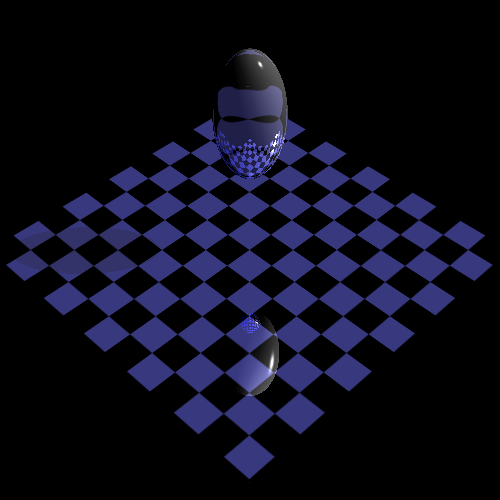
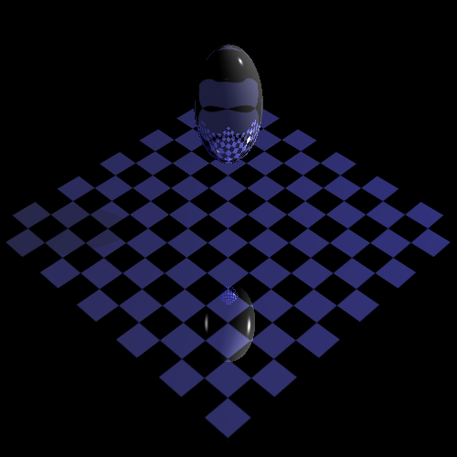
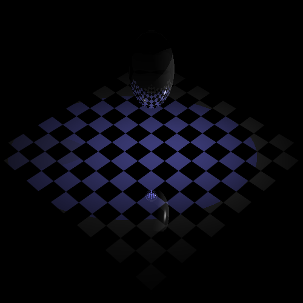

# Ray Tracing

Kevin Druciak

Kdrucia1

Late Days: 3

MSVC / Visual Studio Community 2017 / Windows 10

### Implemented Features:

- Point, Spot, and Directional lights

- Texture mapping for triangles and spheres

- BVH acceleration

- jittered supersampling anti-aliasing

- soft shadows for point and spot lights

  

### Todo:

- Constructive solid geometry
- Procedural texture mapping
- bump mapping
- camera lens simulation
- ray intersection acceleration with octree
- Box, Cylinder, Cone, Torus implementations

### Sample Output:

../Assignments/Assignment2 --in test.directional.ray --out directional.bmp --width 500 --height 500 --rLimit 5 --cutOff 0.0001 --jitter 1 --radius 0
test.directional.ray
	Read: 0.0114883 seconds
	Ray-traced: 2.20595 seconds
	Pixels: 500 x 500
	Primitives: 3
	Rays: 526,967 (2.10787 rays/pixel)
	Primitive intersections: 756,653 (1.43586 intersections/ray)
	Bounding-box intersections: 2,312,753 (4.3888 intersections/ray)

../Assignments/Assignment2 --in test.point.ray --out point.bmp --width 500 --height 500 --rLimit 5 --cutOff 0.0001 --jitter 1 --radius 0
test.point.ray
	Read: 0.0127583 seconds
	Ray-traced: 2.23339 seconds
	Pixels: 500 x 500
	Primitives: 3
	Rays: 528,076 (2.1123 rays/pixel)
	Primitive intersections: 738,861 (1.39916 intersections/ray)
	Bounding-box intersections: 2,290,877 (4.33816 intersections/ray)

../Assignments/Assignment2 --in test.spot.ray --out spot.bmp --width 500 --height 500 --rLimit 5 --cutOff 0.0001 --jitter 1 --radius 0
test.spot.ray
	Read: 0.0135994 seconds
	Ray-traced: 2.2596 seconds
	Pixels: 500 x 500
	Primitives: 3
	Rays: 528,076 (2.1123 rays/pixel)
	Primitive intersections: 738,861 (1.39916 intersections/ray)
	Bounding-box intersections: 2,290,877 (4.33816 intersections/ray)

../Assignments/Assignment2 --in dog.ray --out dog.bmp --width 1600 --height 1200 --rLimit 5 --cutOff 0.0001 --jitter 1 --radius 0
dog.ray
	Read: 0.0264192 seconds
	Ray-traced: 43.5783 seconds
	Pixels: 1600 x 1200
	Primitives: 3222
	Rays: 4,683,980 (2.43957 rays/pixel)
	Primitive intersections: 11,372,632 (2.42798 intersections/ray)
	Bounding-box intersections: 74,774,375 (15.9639 intersections/ray)

../Assignments/Assignment2 --in bunny.ray --out bunny.bmp --width 1600 --height 1200 --rLimit 5 --cutOff 0.0001 --jitter 1 --radius 0
bunny.ray
	Read: 1.21999 seconds
	Ray-traced: 42.8978 seconds
	Pixels: 1600 x 1200
	Primitives: 208,578
	Rays: 3,635,506 (1.89349 rays/pixel)
	Primitive intersections: 11,086,808 (3.04959 intersections/ray)
	Bounding-box intersections: 115,441,322 (31.7539 intersections/ray)

../Assignments/Assignment2 --in dragon.ray --out dragon.bmp --width 1600 --height 1200 --rLimit 5 --cutOff 0.0001 --jitter 1 --radius 0
dragon.ray
	Read: 2.84845 seconds
	Ray-traced: 38.6647 seconds
	Pixels: 1600 x 1200
	Primitives: 500,002
	Rays: 4,018,418 (2.09293 rays/pixel)
	Primitive intersections: 9,174,521 (2.28312 intersections/ray)
	Bounding-box intersections: 104,183,600 (25.9265 intersections/ray)

../Assignments/Assignment2 --in buddha.ray --out buddha.bmp --width 1600 --height 1200 --rLimit 5 --cutOff 0.0001 --jitter 1 --radius 0
buddha.ray
	Read: 4.77904 seconds
	Ray-traced: 63.9628 seconds
	Pixels: 1600 x 1200
	Primitives: 868,330
	Rays: 4,378,822 (2.28064 rays/pixel)
	Primitive intersections: 13,499,055 (3.08281 intersections/ray)
	Bounding-box intersections: 186,332,830 (42.5532 intersections/ray)

../Assignments/Assignment2 --in gargoyle.ray --out gargoyle.bmp --width 1600 --height 1200 --rLimit 5 --cutOff 0.0001 --jitter 1 --radius 0
gargoyle.ray
	Read: 9.66921 seconds
	Ray-traced: 89.2303 seconds
	Pixels: 1600 x 1200
	Primitives: 1,744,876
	Rays: 4,160,085 (2.16671 rays/pixel)
	Primitive intersections: 16,181,222 (3.88964 intersections/ray)
	Bounding-box intersections: 272,897,704 (65.5991 intersections/ray)

../Assignments/Assignment2 --in nefertiti.ray --out nefertiti.bmp --width 1600 --height 1200 --rLimit 5 --cutOff 0.0001 --jitter 1 --radius 0
nefertiti.ray
	Read: 11.1818 seconds
	Ray-traced: 51.6868 seconds
	Pixels: 1600 x 1200
	Primitives: 2,018,234
	Rays: 4,247,604 (2.21229 rays/pixel)
	Primitive intersections: 10,781,303 (2.53821 intersections/ray)
	Bounding-box intersections: 143,609,636 (33.8096 intersections/ray)

../Assignments/Assignment2 --in david.ray --out david.bmp --width 1600 --height 1200 --rLimit 5 --cutOff 0.0001 --jitter 1 --radius 0
david.ray
	Read: 30.8865 seconds
	Ray-traced: 102.168 seconds
	Pixels: 1600 x 1200
	Primitives: 5,269,880
	Rays: 4,547,243 (2.36836 rays/pixel)
	Primitive intersections: 17,966,976 (3.95118 intersections/ray)
	Bounding-box intersections: 304,583,286 (66.982 intersections/ray)

../../Assignments/Assignment2 --in scene.ray --out scene.bmp --width 4000 --height 3000 --rLimit 5 --cutOff 0.0001 --jitter 1 --radius 0
scene.ray
	Read: 1.92873 seconds
	Ray-traced: 978.297 seconds
	Pixels: 4000 x 3000
	Primitives: 34
	Rays: 73,873,725 (6.15614 rays/pixel)
	Primitive intersections: 162,421,928 (2.19864 intersections/ray)
	Bounding-box intersections: 2,665,620,389 (36.0835 intersections/ray)

### Jittered Supersampling and Soft Shadows

These features are **extremely** costly. I implemented them naively

## Notes on output:

#### movie/art contest:

**In order to generate the .gif movie I had to change code in the main method** that calls the morph method. **The line is question is line 132 of main1.cpp**. I wrote a script that creates all of the frames for the movie, but I could not figure out how to pass a floating point number to the method from the script (bash doesn't natively support it). As a workaround, I just divide the whole numbered threshold by the number of frames in the output gif minus 1 to get the threshold for that image.

The command used to create the movie is:

.\createseries.sh --in ./Images/new --bnMorph ./Images/new ./Lines/ --out ./newOut/

This is run from within the "evolution_of_man" folder.

*   **--in**: passes the string "--in" to the script
*   **./Images/new**: passes the first part of the file containing the source image. I iterate from 1 to 16 and append the number as well as the filetype to the end of "./Images/new" to generate something like "./Images/new14.jpg"
*   **--bnMorph**: passes the string "--bnMorph" to the script
*   **./Images/new**: passes the first part of the file containing the destination image. I iterate from 2 to 17 and append the number as well as the filetype to the end of "./Images/new".
*   **./Lines/**: passes the lines folder to the script. Inside this folder is are files named "1.txt" through "16.txt". These contains the line segment information for the morphs.
*   **--out**: passes the string "--out" to the script.
*   **./newOut**: passes the folder containing all of the output transformations. For the evolution of man gif, 400 images are generated and labeled from "1.jpg" to "400.jpg"

The script doesn't actually create the gif. It just create the 400 images. I stitched these together using [https://ezgif.com/maker](https://ezgif.com/maker).

#### 10 frames:

I used a different script to create the 10 frames of me morphing into professional soccer player, Neymar.

The command used to create the movie is:

.\createseries.sh --in .\me.jpg --bnMorph .\neymar.jpg .\me_to_neymar_lines.txt --out .\me_to_neymar_frames\out

This is run from within the "me_to_neymar" folder.

## Additional Notes:

While trying to develop a cool fun filter, I ended up writing a few methods which I never came to use. They are integrated with the existing command line parser and as such can be run on images from the command line.

#### blurNXN

This is run with the name --blurNXN and takes in a sigma and a variance. It does essentially what blur3x3 does but scaled to any radius and any sigma.

#### shiftChannel

This is run with the name --shiftChannel. The user specifies the desired channel and amount to shift it by. This method just add the specified amount to the specified channel for every pixel in the image. The channels are labeled with integers (0 for alpha, 1 for red, 2 for green, 3 for blue).