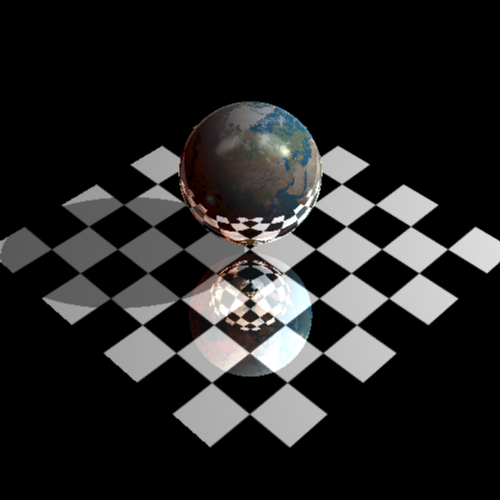
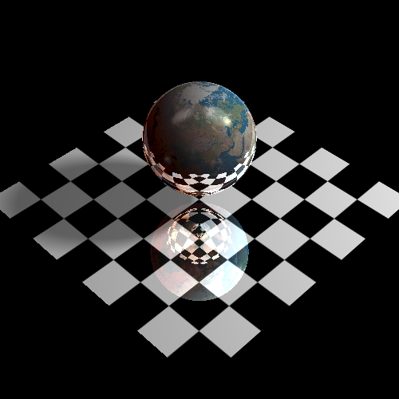

# Ray Tracing

Kevin Druciak

Kdrucia1

Late Days: 4

MSVC / Visual Studio Community 2017 / Windows 10

### Implemented Features:

- Point, Spot, and Directional lights

- Texture mapping for triangles and spheres

- BVH acceleration

- jittered supersampling anti-aliasing

- soft shadows for point and spot lights

  

### Todo:

- Constructive solid geometry
- Procedural texture mapping
- bump mapping
- camera lens simulation
- ray intersection acceleration with octree
- Box, Cylinder, Cone, Torus implementations

### Sample Output:

../Assignments/Assignment2 --in test.directional.ray --out directional.bmp --width 500 --height 500 --rLimit 5 --cutOff 0.0001 --jitter 1 -- sr 0 --radius 0
test.directional.ray
	Read: 0.0114883 seconds
	Ray-traced: 2.20595 seconds
	Pixels: 500 x 500
	Primitives: 3
	Rays: 526,967 (2.10787 rays/pixel)
	Primitive intersections: 756,653 (1.43586 intersections/ray)
	Bounding-box intersections: 2,312,753 (4.3888 intersections/ray)

../Assignments/Assignment2 --in test.point.ray --out point.bmp --width 500 --height 500 --rLimit 5 --cutOff 0.0001 --jitter 1 -- sr 0 --radius 0
test.point.ray
	Read: 0.0127583 seconds
	Ray-traced: 2.23339 seconds
	Pixels: 500 x 500
	Primitives: 3
	Rays: 528,076 (2.1123 rays/pixel)
	Primitive intersections: 738,861 (1.39916 intersections/ray)
	Bounding-box intersections: 2,290,877 (4.33816 intersections/ray)

../Assignments/Assignment2 --in test.spot.ray --out spot.bmp --width 500 --height 500 --rLimit 5 --cutOff 0.0001 --jitter 1 -- sr 0 --radius 0
test.spot.ray
	Read: 0.0135994 seconds
	Ray-traced: 2.2596 seconds
	Pixels: 500 x 500
	Primitives: 3
	Rays: 528,076 (2.1123 rays/pixel)
	Primitive intersections: 738,861 (1.39916 intersections/ray)
	Bounding-box intersections: 2,290,877 (4.33816 intersections/ray)

../Assignments/Assignment2 --in dog.ray --out dog.bmp --width 1600 --height 1200 --rLimit 5 --cutOff 0.0001 --jitter 1 -- sr 0 --radius 0
dog.ray
	Read: 0.0264192 seconds
	Ray-traced: 43.5783 seconds
	Pixels: 1600 x 1200
	Primitives: 3222
	Rays: 4,683,980 (2.43957 rays/pixel)
	Primitive intersections: 11,372,632 (2.42798 intersections/ray)
	Bounding-box intersections: 74,774,375 (15.9639 intersections/ray)

../Assignments/Assignment2 --in bunny.ray --out bunny.bmp --width 1600 --height 1200 --rLimit 5 --cutOff 0.0001 --jitter 1 -- sr 0 --radius 0
bunny.ray
	Read: 1.21999 seconds
	Ray-traced: 42.8978 seconds
	Pixels: 1600 x 1200
	Primitives: 208,578
	Rays: 3,635,506 (1.89349 rays/pixel)
	Primitive intersections: 11,086,808 (3.04959 intersections/ray)
	Bounding-box intersections: 115,441,322 (31.7539 intersections/ray)

../Assignments/Assignment2 --in dragon.ray --out dragon.bmp --width 1600 --height 1200 --rLimit 5 --cutOff 0.0001 --jitter 1 -- sr 0 --radius 0
dragon.ray
	Read: 2.84845 seconds
	Ray-traced: 38.6647 seconds
	Pixels: 1600 x 1200
	Primitives: 500,002
	Rays: 4,018,418 (2.09293 rays/pixel)
	Primitive intersections: 9,174,521 (2.28312 intersections/ray)
	Bounding-box intersections: 104,183,600 (25.9265 intersections/ray)

../Assignments/Assignment2 --in buddha.ray --out buddha.bmp --width 1600 --height 1200 --rLimit 5 --cutOff 0.0001 --jitter 1 -- sr 0 --radius 0
buddha.ray
	Read: 4.77904 seconds
	Ray-traced: 63.9628 seconds
	Pixels: 1600 x 1200
	Primitives: 868,330
	Rays: 4,378,822 (2.28064 rays/pixel)
	Primitive intersections: 13,499,055 (3.08281 intersections/ray)
	Bounding-box intersections: 186,332,830 (42.5532 intersections/ray)

../Assignments/Assignment2 --in gargoyle.ray --out gargoyle.bmp --width 1600 --height 1200 --rLimit 5 --cutOff 0.0001 --jitter 1 -- sr 0 --radius 0
gargoyle.ray
	Read: 9.66921 seconds
	Ray-traced: 89.2303 seconds
	Pixels: 1600 x 1200
	Primitives: 1,744,876
	Rays: 4,160,085 (2.16671 rays/pixel)
	Primitive intersections: 16,181,222 (3.88964 intersections/ray)
	Bounding-box intersections: 272,897,704 (65.5991 intersections/ray)

../Assignments/Assignment2 --in nefertiti.ray --out nefertiti.bmp --width 1600 --height 1200 --rLimit 5 --cutOff 0.0001 --jitter 1 -- sr 0 --radius 0
nefertiti.ray
	Read: 11.1818 seconds
	Ray-traced: 51.6868 seconds
	Pixels: 1600 x 1200
	Primitives: 2,018,234
	Rays: 4,247,604 (2.21229 rays/pixel)
	Primitive intersections: 10,781,303 (2.53821 intersections/ray)
	Bounding-box intersections: 143,609,636 (33.8096 intersections/ray)

../Assignments/Assignment2 --in david.ray --out david.bmp --width 1600 --height 1200 --rLimit 5 --cutOff 0.0001 --jitter 1 -- sr 0 --radius 0
david.ray
	Read: 30.8865 seconds
	Ray-traced: 102.168 seconds
	Pixels: 1600 x 1200
	Primitives: 5,269,880
	Rays: 4,547,243 (2.36836 rays/pixel)
	Primitive intersections: 17,966,976 (3.95118 intersections/ray)
	Bounding-box intersections: 304,583,286 (66.982 intersections/ray)

../../Assignments/Assignment2 --in scene.ray --out scene.bmp --width 4000 --height 3000 --rLimit 5 --cutOff 0.0001 --jitter 1 -- sr 0 --radius 0
scene.ray
	Read: 1.92873 seconds
	Ray-traced: 978.297 seconds
	Pixels: 4000 x 3000
	Primitives: 34
	Rays: 73,873,725 (6.15614 rays/pixel)
	Primitive intersections: 162,421,928 (2.19864 intersections/ray)
	Bounding-box intersections: 2,665,620,389 (36.0835 intersections/ray)

### Jittered Supersampling and Soft Shadows

These features are **extremely** costly. I implemented them naively as a proof of concept. The read and ray trace times are also much lower than they should be here because I decided to run these commands on a more powerful computer. 

#### Jittered Supersampling:

C:\Users\kevin\Desktop\Assignments\kdrucia1.art>..\Assignment2.exe --in earth.ray --out original.bmp --width 500 --height 500 --rLimit 5 --cutOff 0.00001 --jitter 1 --sr 0 --radius 0
earth.ray
    Read: 1.51397 seconds
    Ray-traced: 0.536589 seconds
    Pixels: 500 x 500
    Primitives: 3
    Rays: 745,858 (2.98343 rays/pixel)
    Primitive intersections: 1,319,850 (1.76957 intersections/ray)
    Bounding-box intersections: 3,510,741 (4.70698 intersections/ray)

C:\Users\kevin\Desktop\Assignments\kdrucia1.art>..\Assignment2.exe --in earth.ray --out jitter.bmp --width 500 --height 500 --rLimit 5 --cutOff 0.00001 --jitter 50 --sr 5 --radius 0
earth.ray
    Read: 1.51546 seconds
    Ray-traced: 27.6719 seconds
    Pixels: 500 x 500
    Primitives: 3
    Rays: 37,291,649 (149.167 rays/pixel)
    Primitive intersections: 65,990,820 (1.76959 intersections/ray)
    Bounding-box intersections: 175,530,785 (4.70697 intersections/ray)

C:\Users\kevin\Desktop\Assignments\kdrucia1.art>..\Assignment2.exe --in earth.ray --out jitter100.bmp --width 500 --height 500 --rLimit 5 --cutOff 0.00001 --jitter 100 --sr 1 --radius 0
earth.ray
    Read: 1.51752 seconds
    Ray-traced: 54.7321 seconds
    Pixels: 500 x 500
    Primitives: 3
    Rays: 74,585,857 (298.343 rays/pixel)
    Primitive intersections: 131,988,099 (1.76961 intersections/ray)
    Bounding-box intersections: 351,075,987 (4.707 intersections/ray)

#### Soft Shadows:

..\Assignment.exe --in earth.ray --out soft --width 500 --height 500 --rLimit 5 --cutOff 0.0001 --jitter 1 -- sr 0 --radius 10
scene.ray
	Read: 1.52379 seconds
	Ray-traced: 60.4559 seconds
	Pixels: 500 x 500
	Primitives: 3
	Rays: 76,376,162 (305.505 rays/pixel)
	Primitive intersections: 192,947,381 (2.52628 intersections/ray)
	Bounding-box intersections: 422,021,694 (5.52557 intersections/ray)

## Notes on implementation:

#### New Command Line Parameters:

- ##### --jitter 

  - the number of samples to average in jitter supersampling

- ##### --sr

  - the radius of the jittering samples

- ##### --radius

  - the radius of the light sampling for soft shadows

#### Modified non-todo files:

- camera.h
  - added method getRayJitter for jittered supersampling functionality
- directionaLlight.h
  - modified transparency header to match modified light.h
- light.h
  - modified virtual transparency header
- pointLight.h
  - modified transparency header to match modified light.h
- scene.h
  - modified getColor to support radius
- spotLight.h
  - modified transparency header to match modified light.h
- triangle.h
  - added private fields for pre-computation of values independent of the ray
- window.cpp
  - added --jitter and --radius command line options
- main2.cpp
  - added --jitter and --radius command line options

#### Art Submission:

- ##### kdrucia1.art.2.bmp

- ##### kdrucia1.art.ray + included ray files

#### Known Bugs:

- Directional light does not draw shadows if any element in the position vector is 0. It works if we add some epsilon to those zeros.
- There is noticable artifacting in the larger models. I assume this is because of floating point errors.
- Bounding box intersection collides with whole box, not just front faces and is thus slower. This also means that I have about twice as many bounding box intersections than ideal.
- I cast more rays than in the examples. I assume this has to do poorly-defined termination criteria for recursion.
- Dog looks atrocious.

